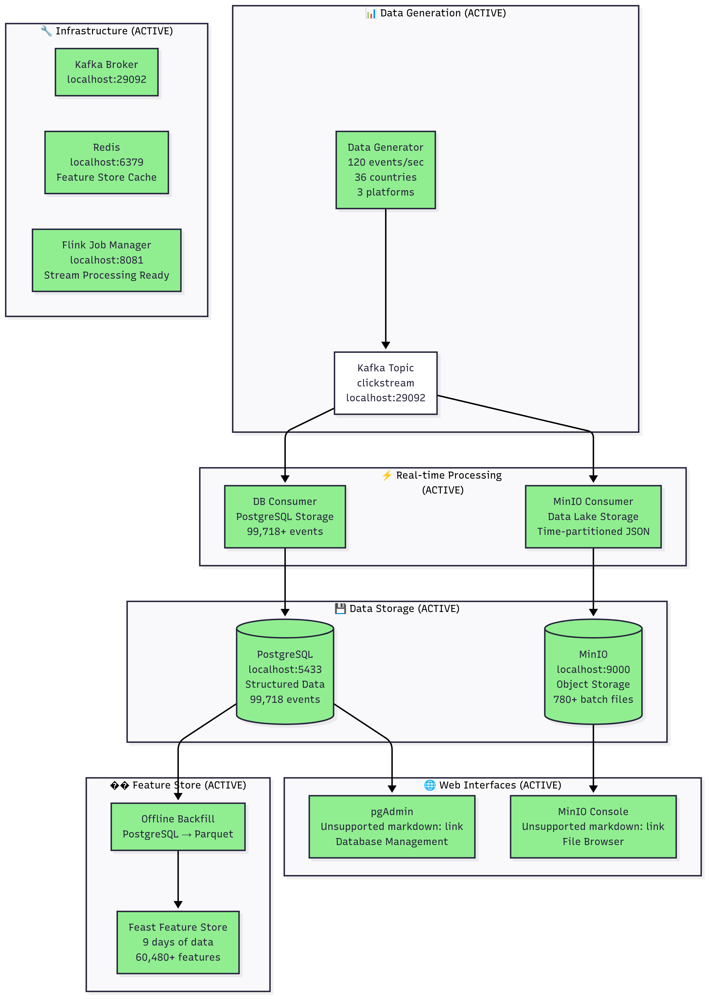

# Adnomaly - Real-Time Clickstream Analytics Platform

A production-ready real-time clickstream analytics platform for detecting ad fraud anomalies with machine learning.

## 🏗️ System Architecture



**Data Generation Pipeline**: Real-time clickstream events flow from the data generator through Kafka to multiple consumers, creating a robust data pipeline with PostgreSQL for structured storage, MinIO for data lake storage, and Feast for feature store management. The system includes comprehensive web interfaces for monitoring and management.

## 🚀 Quick Start

### Prerequisites
- **Docker** (with Docker Compose)
- **Python 3.11+**
- **Make** (usually comes with macOS/Linux)

### 1. Start Infrastructure
```bash
make up
```

### 2. Generate Data
```bash
make gen
```

### 3. Store Data
```bash
# Store in database (recommended)
make db-consumer

# OR store in data lake
make minio-consumer

# OR just view live data
make tail
```

## 🌐 Web Interfaces

### pgAdmin (Database Management)
- **URL**: http://localhost:5050
- **Email**: admin@adnomaly.com
- **Password**: admin123
- **Connection**: Host: `postgres`, Port: `5432`, Database: `adnomaly`, Username: `adnomaly_user`, Password: `adnomaly_password`

### MinIO Console (Data Lake)
- **URL**: http://localhost:9001
- **Username**: minioadmin
- **Password**: minioadmin123

### Flink UI (Stream Processing)
- **URL**: http://localhost:8081

## 📊 Data Schema

### Clickstream Event
```json
{
  "timestamp": "2024-01-15T10:30:00.000Z",
  "user_id_hash": "a1b2c3d4e5f67890",
  "ad_id": "ad_1234",
  "campaign_id": "camp_567",
  "geo": "US",
  "platform": "web",
  "user_agent": "Mozilla/5.0...",
  "CPC": 0.75,
  "CTR": 0.025,
  "conversion": 0,
  "bounce_rate": 0.45
}
```

## 🛠️ Available Commands

### Core Operations
```bash
make up              # Start all services
make down            # Stop all services
make create-topic    # Create Kafka topics
make gen             # Generate clickstream data
make test            # Run all tests
```

### Data Consumers
```bash
make tail            # View live events
make db-consumer     # Store in PostgreSQL
make minio-consumer  # Store in MinIO
make tail-features   # View processed features
```

### Feature Store
```bash
make feast-apply     # Apply Feast configuration
make feast-backfill  # Export data to parquet
make feast-ingestor  # Start Kafka → Redis ingestor
make feast-test      # Test feature retrieval
```

### Model Training & Serving
```bash
make build-ds        # Build dataset for training
make train-model     # Train Isolation Forest model
make eval-model      # Evaluate model performance
make export-onnx     # Export model to ONNX format
make serve           # Start model serving API
make docker-build    # Build serving Docker image
make docker-run      # Run serving in Docker
```

### Development Tools
```bash
make db-query        # Query database statistics
make flink-submit    # Submit Flink processing job
```

## 🔧 Configuration

### Environment Variables
```bash
# Data Generation
BASE_EPS=120                # Base events per second
HASH_SALT=balanced123       # Data consistency
SEED=42                     # Random seed

# Temporal Variation
DIURNAL_AMPL=0.6            # Diurnal amplitude (0..1)
PEAK_HOUR_UTC=20            # Hour of daily maximum
WEEKEND_MULT=0.85           # Weekend volume multiplier

# Geographic Distribution
GEO_WEIGHTS=US:0.30,IN:0.20,BR:0.12,DE:0.08,FR:0.08,UK:0.08,CA:0.06,JP:0.04,IT:0.02,AU:0.02

# Platform Distribution
PLATFORM_WEIGHTS=web:0.45,android:0.30,ios:0.25

# Metric Shaping
CTR_BASE=0.022              # Baseline click-through rate
CTR_DIURNAL_AMPL=0.35       # CTR diurnal amplitude
BOUNCE_BASE=0.36            # Baseline bounce rate
BOUNCE_DIURNAL_AMPL=0.20    # Bounce rate diurnal amplitude

# Noise Parameters
NOISE_STD_CTR=0.002         # CTR noise standard deviation
NOISE_STD_BOUNCE=0.02       # Bounce rate noise standard deviation
NOISE_STD_CPC=0.05          # CPC noise standard deviation

# Infrastructure
KAFKA_BOOTSTRAP=localhost:29092
DB_HOST=localhost
DB_PORT=5433
DB_NAME=adnomaly
DB_USER=adnomaly_user
DB_PASSWORD=adnomaly_password
MINIO_ENDPOINT=localhost:9000
MINIO_ACCESS_KEY=minioadmin
MINIO_SECRET_KEY=minioadmin123
MINIO_BUCKET=adnomaly-data

# Model Serving
MODEL_PATH=model/artifacts/isoforest.onnx
PREPROCESS_PATH=model/artifacts/preprocess.json
THRESHOLD_PATH=model/artifacts/threshold.json
LOG_LEVEL=INFO
```

### Port Configuration
- **Kafka**: 29092
- **PostgreSQL**: 5433
- **MinIO**: 9000 (API), 9001 (Console)
- **pgAdmin**: 5050
- **Flink**: 8081
- **Redis**: 6379
- **Model Serving**: 8080

## 🤖 Machine Learning Pipeline

### Model Training
The system uses an **Isolation Forest** for anomaly detection:

1. **Data Preparation**: Features are extracted from 5-minute sliding windows
2. **Feature Engineering**: 
   - `ctr_avg`: Average click-through rate (0..1)
   - `bounce_rate_avg`: Average bounce rate (0..1) 
   - `event_count`: Log-transformed event count
3. **Preprocessing**: Standardization using training statistics
4. **Training**: Time-based split (80% train, 20% eval)
5. **Evaluation**: Synthetic anomaly injection with comprehensive metrics

### Model Serving
The trained model is served via a **FastAPI** web service:

```bash
# Start serving service
make serve

# Test single prediction
curl -X POST http://localhost:8080/v1/score \
  -H 'content-type: application/json' \
  -d '{"ctr_avg":0.03,"bounce_rate_avg":0.62,"event_count":350}'

# Test batch prediction
curl -X POST http://localhost:8080/v1/batch \
  -H 'content-type: application/json' \
  -d '{"rows":[{"ctr_avg":0.02,"bounce_rate_avg":0.35,"event_count":100}]}'
```

### Model Endpoints
- `GET /healthz` - Health check
- `GET /readyz` - Readiness check
- `GET /metrics` - Prometheus metrics
- `POST /v1/score` - Single row scoring
- `POST /v1/batch` - Batch scoring (up to 1000 rows)

### Model Response
```json
{
  "anomaly_score": 1.2,
  "is_anomaly": true,
  "threshold": 0.61,
  "features_used": ["ctr_avg", "bounce_rate_avg", "event_count"],
  "meta": {"geo": "US", "platform": "ios"}
}
```

## 📁 Project Structure
```
Adnomaly/
├── data/                   # Data generation
├── consumers/              # Data storage consumers
├── streaming/              # Stream processing
├── features/               # Feature store
├── model/                  # ML pipeline
├── serving/                # Model serving API
├── infra/                  # Infrastructure
├── tests/                  # Test suite
├── requirements.txt        # Dependencies
├── Makefile               # Commands
└── README.md              # This file
```

## 🧪 Testing

### Run All Tests
```bash
make test
```

### Test Specific Components
```bash
# Test data generation
python -m pytest tests/test_schema.py

# Test serving API
python -m pytest tests/test_serving_contract.py

# Test streaming
python -m pytest tests/test_streaming_contract.py
```

## 🚨 Troubleshooting

### Common Issues

#### Port Conflicts
```bash
# Check if ports are in use
lsof -i :29092  # Kafka
lsof -i :5433   # PostgreSQL
lsof -i :9000   # MinIO
lsof -i :5050   # pgAdmin
```

#### Data Not Appearing
```bash
# Check if containers are running
docker ps

# Check if topics exist
make create-topic

# Restart consumers if needed
make db-consumer
```

#### Model Serving Issues
```bash
# Check if model artifacts exist
ls -la model/artifacts/

# Test serving locally
make serve

# Check logs
docker logs <container-name>
```

### Reset Everything
```bash
# Stop all services
make down

# Start fresh
make up

# Create topics
make create-topic

# Regenerate data
make gen
```

## 📚 Dependencies

### Core Dependencies
- **Streaming**: confluent-kafka, pyflink
- **Data Processing**: pandas, numpy, scikit-learn
- **Feature Store**: feast[redis]
- **Storage**: psycopg2-binary, boto3, redis
- **ML**: onnx, onnxruntime, matplotlib
- **Serving**: fastapi, uvicorn, prometheus-client
- **Testing**: pytest

## 📄 License

This project is licensed under the MIT License - see the [LICENSE](LICENSE) file for details.
